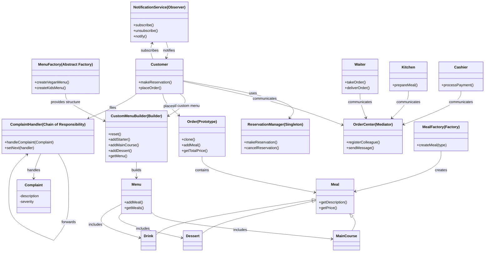
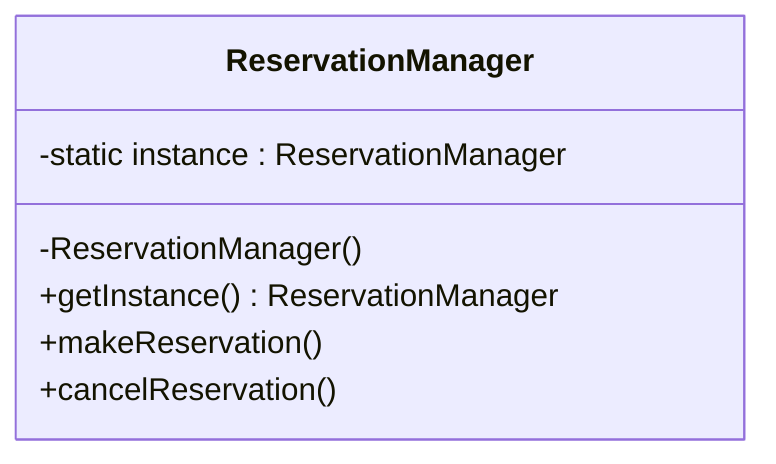
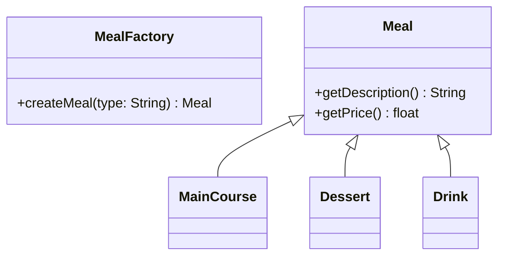
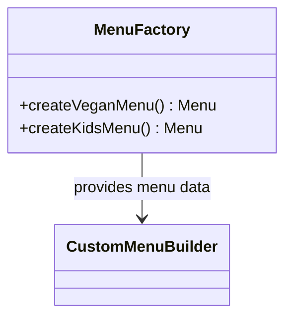
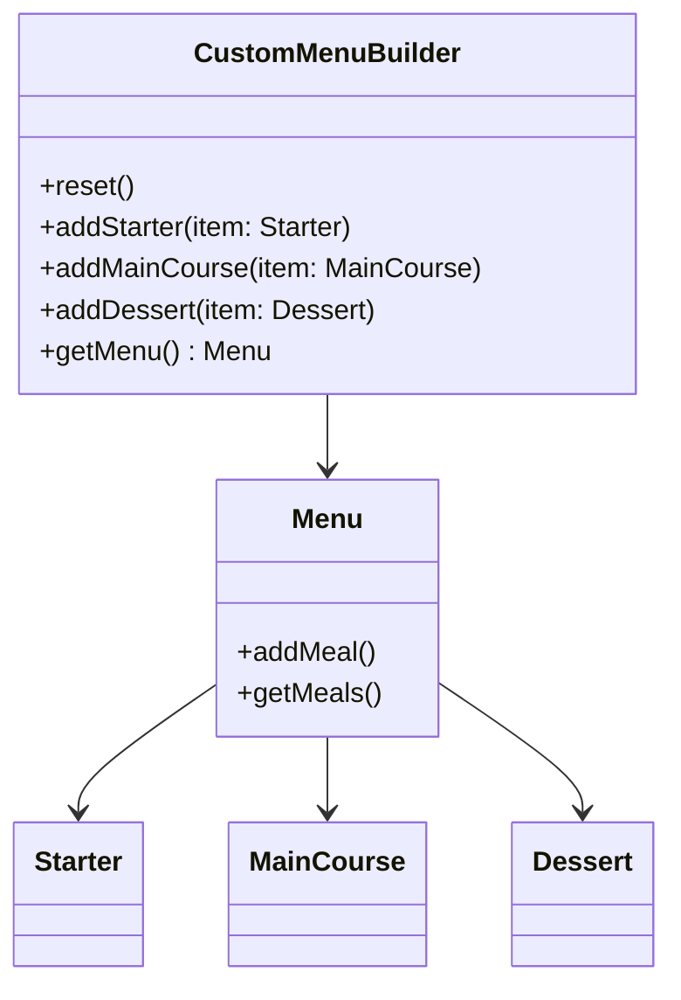
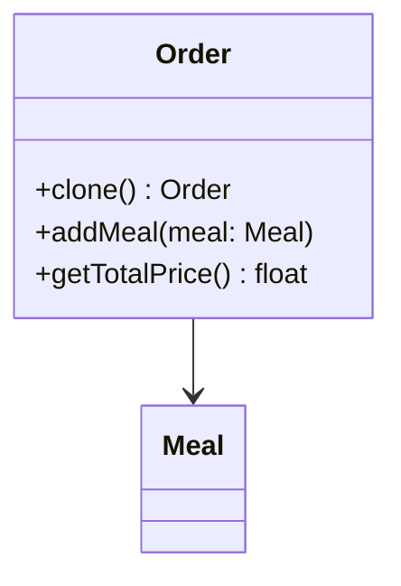
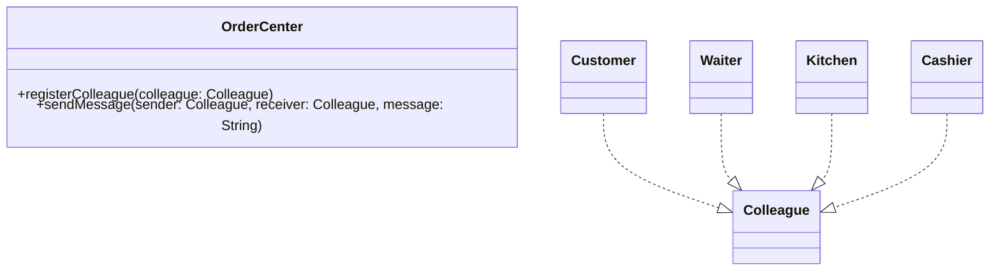
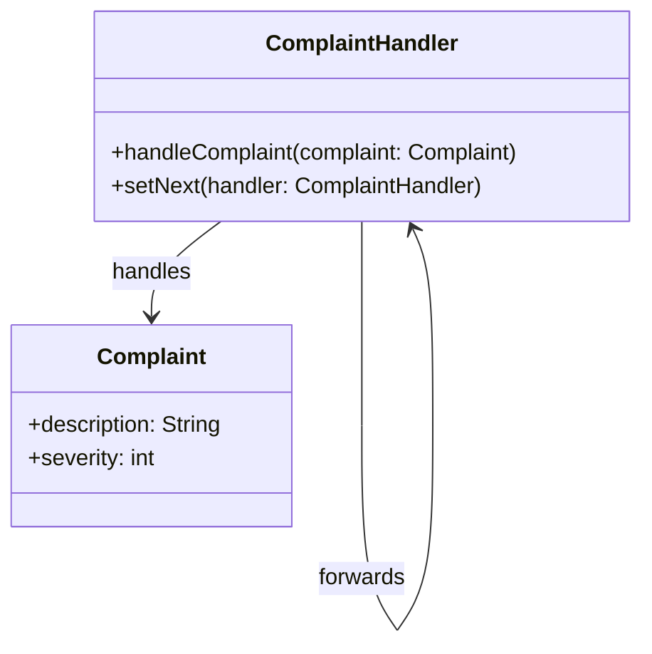
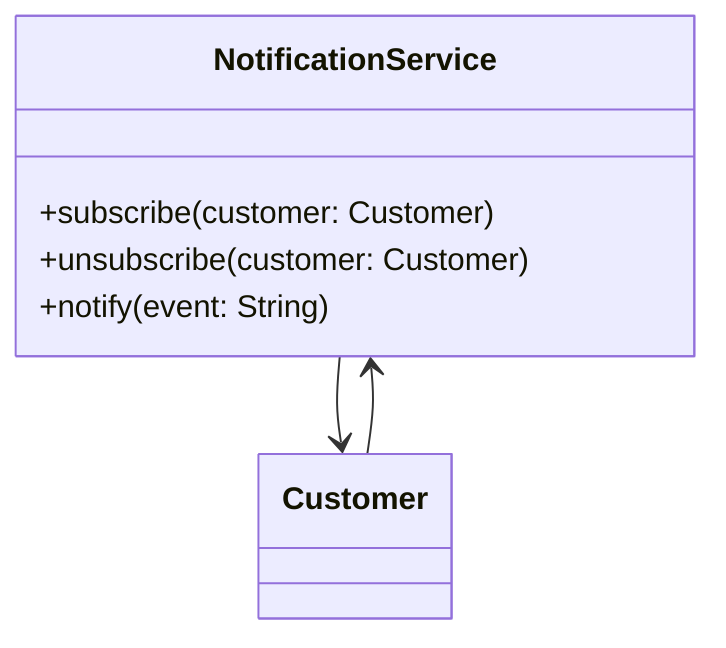

# Restoran Rezervasyon ve Siparis Sistemi

**Hazırlayan:** Ali Elbashir

## Senaryo

Bu projede bir restoranın rezervasyon, sipariş, menü oluşturma, şikayet yönetimi ve müşteri bilgilendirme süreçlerini kapsayan bir sistem tasarlanmıştır. Sistemin amacı, restoran içinde yürütülen operasyonları daha düzenli ve sürdürülebilir hale getirmek, farklı aktörler arasındaki iletişimi standartlaştırmak ve tekrarlayan işlemleri optimize etmektir. Çözümde farklı tasarım örüntüleri kullanılarak sistemin genişleyebilir, modüler ve bakımı kolay olması hedeflenmiştir.

## Kullanılan Tasarım Örüntüleri

| Tasarım Örüntüsü        | Sınıf Adı            | Açıklama |
|-------------------------|----------------------|----------|
| Singleton               | ReservationManager   | Rezervasyon işlemlerinin uygulama boyunca merkezi ve tek bir örnek tarafından yönetilmesi sağlanır. |
| Factory                 | MealFactory          | Tek tek yemek türlerinin (`MainCourse`, `Dessert`, `Drink`) `type` parametresiyle oluşturulması için kullanılır. |
| Abstract Factory        | MenuFactory          | Birbiriyle ilişkili yemek gruplarını içeren menü kombinasyonlarını (örneğin çocuk veya vegan menü) tek seferde üretmek için kullanılır. |
| Builder                 | CustomMenuBuilder    | Menü öğelerinin (başlangıç, ana yemek, tatlı) kullanıcı isteğine göre adım adım bir araya getirilmesini sağlar. |
| Prototype               | Order                | Daha önce oluşturulmuş bir siparişin birebir kopyalanarak yeniden kullanılmasına olanak tanır. |
| Mediator                | OrderCenter          | Farklı birimler (müşteri, garson, mutfak, kasa) arasında doğrudan bağlantı olmadan mesajlaşma sağlar. |
| Chain of Responsibility | ComplaintHandler     | Gelen şikayetlerin sıralı bir şekilde ilgili kişilere yönlendirilmesini ve uygun olanın işlemesini sağlar. |
| Observer                | NotificationService  | Müşteriler sisteme abone olur ve sistemdeki olaylardan (örneğin sipariş durumu) otomatik olarak haberdar edilir. |

## Genel Sistem Diyagramı

## Tasarım Örüntülerine Ait UML Diyagramları

### Singleton – ReservationManager

### Factory – MealFactory

### Abstract Factory – MenuFactory

### Builder – CustomMenuBuilder

### Prototype – Order

### Mediator – OrderCenter

### Chain of Responsibility – ComplaintHandler

### Observer – NotificationService

